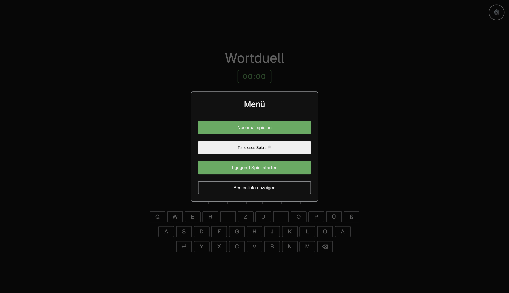
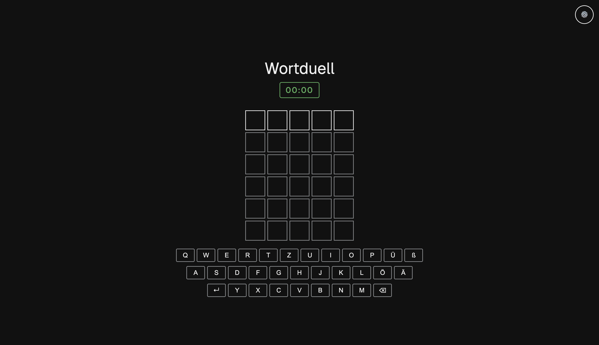
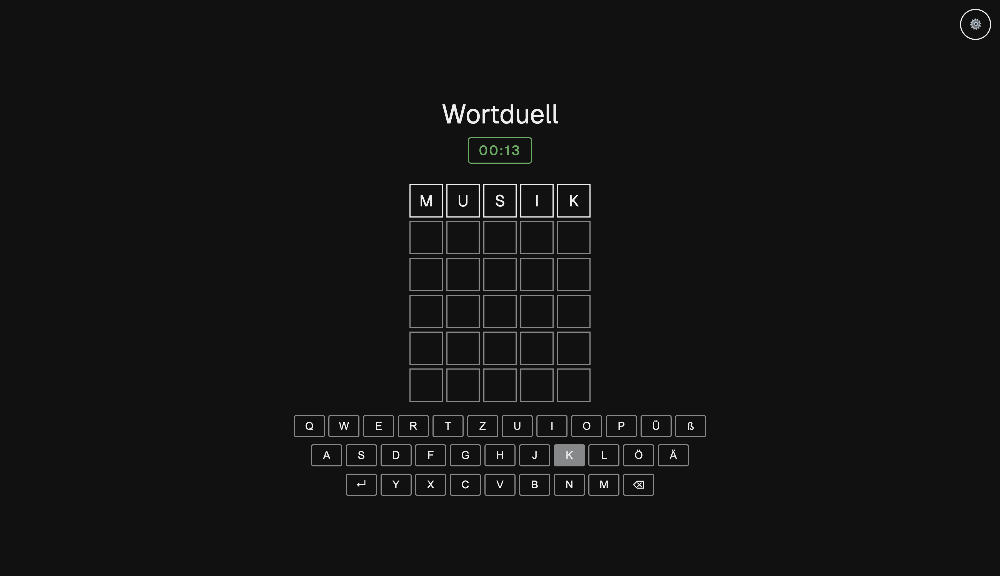
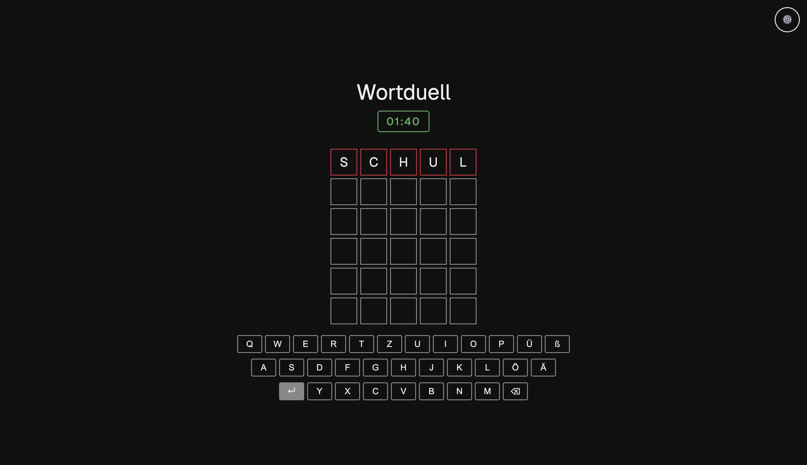
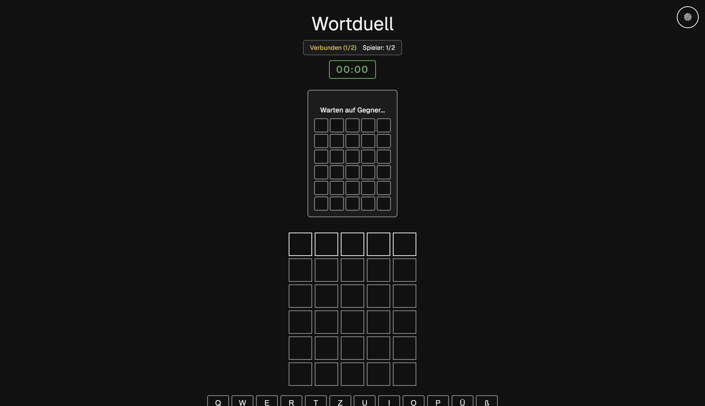
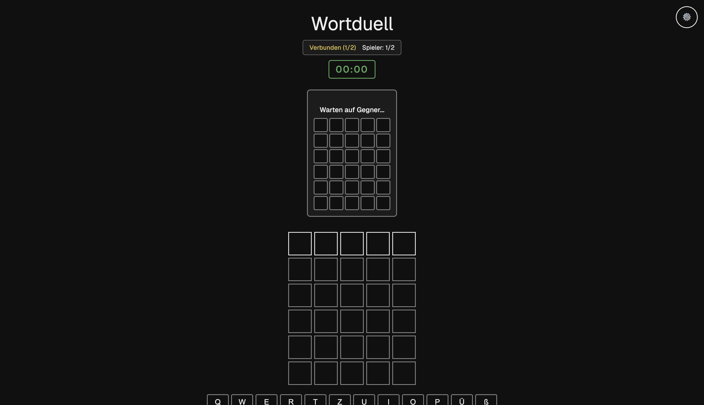
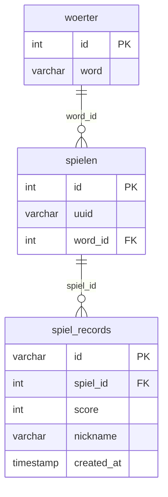
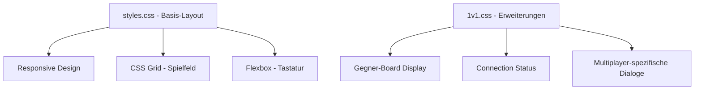
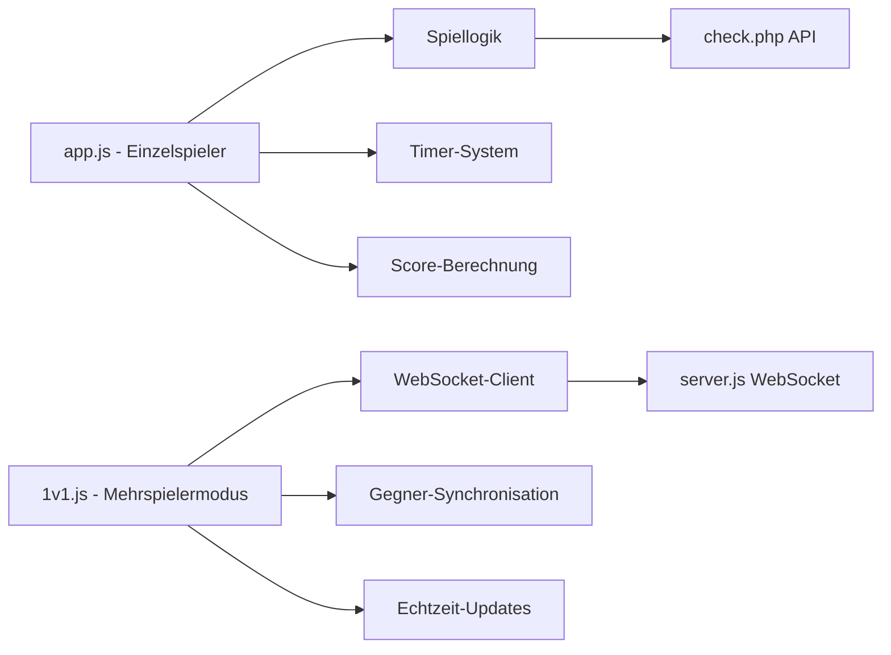
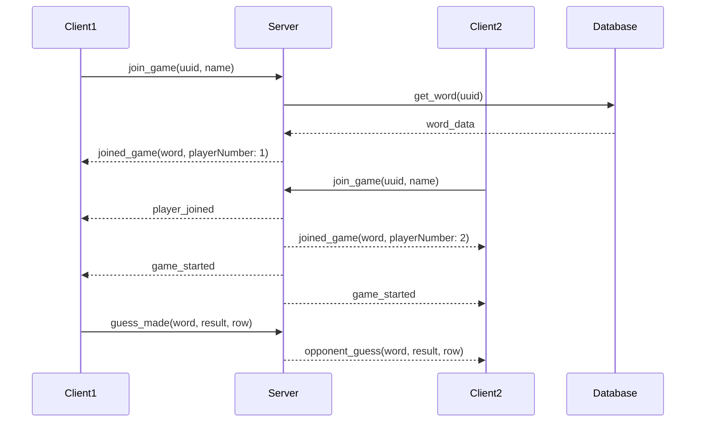

# Projektdokumentation

**Modul:** Web Engineering 2  
**Projektname:** Wortduell - Webbasierte deutsche Worträtsel-Anwendung  
**Abgabedatum:** Juni 2025

## 🌐 Live-Demonstration

**🌍 Live-URL:** [http://152.53.112.174:8081/](http://152.53.112.174:8081/)

> **⚠️ Wichtiger Hinweis:** Da die Live-Anwendung über HTTP (nicht HTTPS) bereitgestellt wird, funktioniert die automatische Zwischenablage-Funktion in modernen Browsern nicht. Dies ist eine Sicherheitsbeschränkung der Browser und betrifft nur die Live-Demo. Bei lokaler HTTPS-Installation funktioniert das Feature vollständig.

**Verfügbare Modi:**

- Einzelspieler-Modus: http://152.53.112.174:8081/
- 1v1-Modus: http://152.53.112.174:8081/1v1.php

### Screenshots der Anwendung

#### Hauptmenü und Navigation


_Das Hauptmenü mit Navigation zwischen Solo- und 1v1-Modus_

#### Einzelspieler-Gameplay


_Das Hauptspielfeld im Einzelspieler-Modus mit deutscher QWERTZ-Tastatur_


_Aktive Spielsituation mit Farbfeedback nach Worteingabe_


_Während der Worteingabe: Spieler gibt "SCHUL" ein_

#### Multiplayer 1v1-Modus


_Der 1v1-Modus mit geteiltem Bildschirm für zwei Spieler_


_Wartebereich im 1v1-Modus: Warten auf den zweiten Spieler_

### Live-Deployment Details

**Server-Spezifikationen:**

- **URL:** http://152.53.112.174:8081/
- **PHP-Server:** Port 8080 (Apache via Docker)
- **WebSocket-Server:** Port 3000 (Node.js)
- **Datenbank:** MariaDB 10.4 (integriert)
- **Container-Technologie:** Docker mit Docker Compose

**Verfügbare Endpunkte:**

- Hauptspiel: `http://152.53.112.174:8081/`
- 1v1-Modus: `http://152.53.112.174:8081/1v1.php`
- WebSocket: `ws://152.53.112.174:3000`

**Status der Anwendung:**

- ✅ Vollständig funktionsfähig
- ✅ Responsive Design (Desktop/Mobile)
- ✅ WebSocket-Echtzeit-Kommunikation aktiv
- ✅ Datenbank-Integration funktional
- ✅ Spiel-Sharing über URL möglich

---

## 1. Technische Dokumentation

Das Projekt **Wortduell** wurde im Rahmen des Moduls Web Engineering 2 entwickelt und verfolgt das Ziel, eine interaktive, webbasierte Adaption des beliebten Worträtselspiels Wordle für die deutsche Sprache bereitzustellen. Die Anwendung ermöglicht es Benutzern, sowohl im Einzelspielermodus als auch im Echtzeit-Mehrspielermodus (1v1) deutsche 5-Buchstaben-Wörter zu erraten. Das Projekt berücksichtigt moderne Webentwicklungsstandards, einschließlich responsivem Design, serverseitiger Logik mit PHP, Echtzeit-Kommunikation über WebSockets und der Anbindung an eine relationale MariaDB-Datenbank.

### Projektstruktur

Die Anwendung folgt einer klaren modularen Struktur zur Gewährleistung der Trennung von Präsentation, Geschäftslogik und Datenzugriff:

```
WebEngineering-Project/
├── config/
│   └── database.php              # Zentrale Datenbankverbindung
├── index.php                     # Hauptseite - Einzelspielermodus
├── 1v1.php                      # Mehrspielermodus-Interface
├── server.js                    # Node.js WebSocket-Server
├── app.js                       # Frontend-Logik Einzelspieler
├── 1v1.js                      # Frontend-Logik Mehrspielermodus
├── styles.css                   # Hauptstylesheet
├── 1v1.css                     # Spezifische Styles für 1v1-Modus
├── get_word.php                 # API: Wortabruf für Spiele
├── save_score.php               # API: Score-Speicherung
├── get_scoreboard.php           # API: Bestenlisten-Abruf
├── check.php                    # API: Wort-Validierung
├── words.txt                    # Wörterbuch (3.012 deutsche Wörter)
├── docker-compose.yml           # Container-Orchestrierung
├── Dockerfile                   # Container-Definition
└── package.json                 # Node.js-Abhängigkeiten
```

**Strukturprinzipien:**

- **config/**: Enthält Konfigurationsdateien für Datenbankverbindungen mit Umgebungsvariablen-Support
- **Hauptseiten**: `index.php` und `1v1.php` als zentrale Einstiegspunkte
- **API-Endpunkte**: Separate PHP-Dateien für spezifische Backend-Funktionalitäten
- **Frontend-Assets**: Getrennte JavaScript- und CSS-Dateien für verschiedene Spielmodi
- **DevOps**: Docker-Konfiguration für konsistente Entwicklungs- und Produktionsumgebung

### Verwendete Technologien

| Technologie           | Verwendung im Projekt                                                       |
| --------------------- | --------------------------------------------------------------------------- |
| **HTML5**             | Semantische Struktur mit modernen Web-Standards, Dialog-Elemente für Modals |
| **CSS3**              | Responsives Design über externe Stylesheets, CSS Grid/Flexbox für Layout    |
| **JavaScript (ES6+)** | Spiellogik, DOM-Manipulation, WebSocket-Kommunikation, Timer-Funktionalität |
| **PHP 8.2**           | Serverseitige Logik, Session-Management, API-Endpunkte, Datenbankanbindung  |
| **Node.js**           | WebSocket-Server für Echtzeit-Mehrspielerkommunikation                      |
| **MariaDB**           | Relationale Datenbank für Spieldaten, Scores und Wörterbuch                 |
| **WebSocket**         | Bidirektionale Echtzeit-Kommunikation im Mehrspielermodus                   |
| **Docker**            | Containerisierung und Deployment-Automatisierung                            |

### Datenbankmodell

Die Anwendung basiert auf einem relationalen Datenbankmodell mit drei zentralen Tabellen:



#### Tabelle: `woerter`

Zentrale Wörterbuch-Tabelle mit allen verfügbaren deutschen 5-Buchstaben-Wörtern:

```sql
CREATE TABLE woerter (
    id INT(6) UNSIGNED AUTO_INCREMENT PRIMARY KEY,
    word VARCHAR(5) NOT NULL
);
```

#### Tabelle: `spielen`

Spiel-Instanzen mit eindeutigen UUIDs für Spiel-Sharing:

```sql
CREATE TABLE spielen (
    id INT(6) UNSIGNED AUTO_INCREMENT PRIMARY KEY,
    uuid VARCHAR(36) NOT NULL DEFAULT (UUID()),
    word_id INT(6) UNSIGNED,
    FOREIGN KEY (word_id) REFERENCES woerter(id)
);
```

#### Tabelle: `spiel_records`

Persistente Speicherung von Spielergebnissen für Bestenlisten:

```sql
CREATE TABLE spiel_records (
    id VARCHAR(36) PRIMARY KEY DEFAULT (UUID()),
    spiel_id INT(6) UNSIGNED,
    score INT UNSIGNED NOT NULL CHECK (score >= 0 AND score <= 5000),
    nickname VARCHAR(3) NOT NULL,
    created_at TIMESTAMP DEFAULT CURRENT_TIMESTAMP,
    FOREIGN KEY (spiel_id) REFERENCES spielen(id)
);
```

### Frontend-Architektur

#### HTML-Struktur & Semantik

Die Anwendung nutzt semantisches HTML5 mit strukturierten Elementen:

- `<main>` für Hauptinhaltsbereiche
- `<dialog>` für modale Fenster (Gewinn/Verlust, Menü, Bestenliste)
- `<section>` für logische Inhaltsbereiche (Spielfeld, Tastatur)
- Datenattribute für JavaScript-Selektoren (`data-row`, `data-column`)

#### CSS & Layout



Das Layout wurde vollständig responsiv gestaltet:

- **CSS Grid** für das 6x5 Spielfeld-Layout
- **Flexbox** für die deutsche QWERTZ-Tastatur mit Umlauten
- **Media Queries** für Tablet- und Mobile-Ansichten
- **CSS Custom Properties** für konsistente Farbschemata

#### JavaScript-Architektur



### Backend-Implementierung

#### PHP-Serverseitige Logik

**Formularverarbeitung und Validierung:**

```php
// Beispiel: Wort-Validierung in check.php
$word = trim(strtoupper($_POST['word']));
if (strlen($word) !== 5) {
    http_response_code(400);
    echo json_encode(['error' => 'Wort muss 5 Buchstaben haben']);
    exit;
}
```

**Session-Management:**

- UUID-basierte Spiel-Identifikation
- URL-Parameter für Spiel-Sharing
- Automatische Spiel-Erstellung bei Erstaufruf

**Datenbankzugriffe:**
Alle Datenbankoperationen nutzen vorbereitete Statements zur SQL-Injection-Prävention:

```php
$stmt = $conn->prepare("SELECT word FROM woerter WHERE id = ?");
$stmt->bind_param("i", $word_id);
$stmt->execute();
$stmt->bind_result($spiel_word);
$stmt->fetch();
```

#### Node.js WebSocket-Server

**Architektur des Echtzeit-Systems:**



**Spielraum-Management:**

```javascript
const gameRooms = new Map(); // UUID -> {players: [], gameState: {...}}
const playerConnections = new Map(); // WebSocket -> Player

async function handleJoinGame(ws, spiel_uuid, player_name) {
  if (!gameRooms.has(spiel_uuid)) {
    gameRooms.set(spiel_uuid, {
      players: [],
      gameState: {
        /* Initialer Zustand */
      },
    });
  }
  // Spieler hinzufügen und Spiel starten bei 2 Spielern
}
```

### API-Endpunkte

#### GET /get_word.php

```php
// Abruf des Wortes für ein spezifisches Spiel
header('Content-Type: application/json');
$uuid = $_GET['uuid'] ?? '';
$stmt = $conn->prepare("SELECT w.word FROM woerter w
                       JOIN spielen s ON w.id = s.word_id
                       WHERE s.uuid = ?");
$stmt->bind_param("s", $uuid);
$stmt->execute();
$result = $stmt->get_result();
echo json_encode(['word' => $row['word']]);
```

#### POST /save_score.php

```php
// Speicherung von Spielergebnissen
$spiel_uuid = $_POST['spiel_uuid'];
$nickname = substr($_POST['nickname'], 0, 3); // Max 3 Zeichen
$score = (int)$_POST['score'];

$stmt = $conn->prepare("INSERT INTO spiel_records (spiel_id, score, nickname)
                       SELECT s.id, ?, ? FROM spielen s WHERE s.uuid = ?");
$stmt->bind_param("iss", $score, $nickname, $spiel_uuid);
```

### Spielmechanik-Implementierung

#### Scoring-Algorithmus

```javascript
const calculateScore = (elapsedTimeInSeconds, incorrectGuesses) => {
  if (game_lost) return 0;
  if (incorrectGuesses === 0) return 5000; // Perfektes Spiel

  let baseScore = 4000;
  const timePenalty = Math.floor(elapsedTimeInSeconds / 10) * 50;
  const guessPenalty = incorrectGuesses * 250;

  return Math.max(1, baseScore - timePenalty - guessPenalty);
};
```

#### Wort-Validierung (Wordle-Logik)

```javascript
const checkWordLocally = (guess, targetWord) => {
  const result = [];
  const guessChars = guess.split("");
  const targetChars = targetWord.split("");
  const targetCharCount = {};

  // Zeichenhäufigkeit zählen
  for (let char of targetChars) {
    targetCharCount[char] = (targetCharCount[char] || 0) + 1;
  }

  // Grüne Buchstaben (korrekte Position)
  for (let i = 0; i < 5; i++) {
    if (guessChars[i] === targetChars[i]) {
      result[i] = "green";
      targetCharCount[guessChars[i]]--;
    } else {
      result[i] = null;
    }
  }

  // Gelbe und graue Buchstaben
  for (let i = 0; i < 5; i++) {
    if (result[i] === null) {
      if (targetCharCount[guessChars[i]] > 0) {
        result[i] = "yellow";
        targetCharCount[guessChars[i]]--;
      } else {
        result[i] = "gray";
      }
    }
  }

  return result;
};
```

### Sicherheitsaspekte

**SQL-Injection-Schutz:**

- Ausschließliche Verwendung von Prepared Statements
- Parameter-Binding für alle Benutzereingaben
- Input-Validierung und -Sanitization

**Cross-Site-Scripting (XSS) Prävention:**

```php
echo '<strong>' . htmlspecialchars($spiel_word) . '</strong>';
```

**Umgebungsvariablen für sensible Daten:**

```php
$db_config = [
    'host' => $_ENV['DB_HOST'] ?? getenv('DB_HOST') ?: '0.0.0.0',
    'username' => $_ENV['DB_USER'] ?? getenv('DB_USER') ?: 'mariadb',
    'password' => $_ENV['DB_PASSWORD'] ?? getenv('DB_PASSWORD') ?: 'mariadb'
];
```

## 2. Benutzerdokumentation

### Systemanforderungen

Zur Ausführung des Projekts ist eine lokale Entwicklungsumgebung erforderlich, die PHP und MariaDB/MySQL unterstützt. Für die lokale Nutzung empfiehlt sich Docker mit Docker Compose, das alle benötigten Komponenten gebündelt zur Verfügung stellt. Die Webanwendung wurde mit PHP 8.2, Node.js 18+ und MariaDB 10.4 entwickelt.

**Erforderliche Komponenten:**

- Docker & Docker Compose (empfohlen)
- PHP ab Version 8.0 mit mysqli-Extension
- Node.js ab Version 16.0 mit npm
- MariaDB/MySQL ab Version 5.7
- Moderner Webbrowser mit WebSocket-Unterstützung

### Installation und Setup

#### Option 1: Docker (Empfohlen)

1. **Repository klonen:**

```bash
git clone https://github.com/TheOguzhan/WebEngineering-Project.git
cd WebEngineering-Project
```

2. **Container starten:**

```bash
docker-compose up -d
```

3. **Anwendung aufrufen:**
   - Hauptanwendung: http://localhost:8080
   - 1v1-Modus: http://localhost:8080/1v1.php

### Funktionen und Bedienung

#### Einzelspielermodus (index.php)

**Spielstart:**

- Beim ersten Aufruf wird automatisch ein neues Spiel erstellt
- Das zu erratende Wort wird zufällig aus 3.012 deutschen Wörtern gewählt
- Spiel-URL wird automatisch generiert und kann geteilt werden

**Spielmechanik:**

- 6 Versuche zum Erraten eines 5-Buchstaben deutschen Wortes
- Deutsche QWERTZ-Tastatur mit Umlauten (Ä, Ö, Ü, ß)
- Farbcodierung: Grün (richtige Position), Gelb (falscher Ort), Grau (nicht im Wort)
- Timer startet bei der ersten Eingabe
- Score-Berechnung basierend auf Zeit und Anzahl Versuche

**Spielende:**

- Bei Gewinn: Score-Eingabe mit 3-stelligem Spitznamen
- Automatische Speicherung in der Bestenliste
- Möglichkeit zur Spielwiederholung

#### Mehrspielermodus (1v1.php)

**Verbindungsaufbau:**

- WebSocket-Verbindung zum Node.js-Server
- Anzeige des Verbindungsstatus und Spieleranzahl
- Automatischer Spielstart bei 2 verbundenen Spielern

**Multiplayer-Features:**

- Echtzeit-Synchronisation der Spielzüge
- Anzeige des Gegner-Spielfelds
- Simultanes Spielen desselben Wortes
- Chat-ähnliche Status-Updates

**Spielende-Bedingungen:**

- Erster Spieler der das Wort errät gewinnt
- Beide Spieler sehen das Endergebnis
- Bestenlisten-Speicherung für beide Teilnehmer

#### Menü-Funktionen

**Spielmenü (⚙️-Button):**

- **Neues Spiel starten:** Zur Hauptseite zurückkehren
- **Spiel teilen:** URL in Zwischenablage kopieren
- **1v1-Modus:** Zum Mehrspielermodus wechseln
- **Bestenliste:** Scores für aktuelles Spiel anzeigen

**Bestenliste:**

- Anzeige der Top-Scores für das aktuelle Spiel
- Sortierung nach Punktzahl (absteigend)
- Anzeige von Spitzname, Score und Datum

### Tastatursteuerung

**Physische Tastatur:**

- Buchstaben A-Z, Umlaute Ä, Ö, Ü, ß
- ENTER: Wort bestätigen
- BACKSPACE: Letzten Buchstaben löschen

**Virtuelle Tastatur:**

- Klickbare deutsche QWERTZ-Layout
- Farbliche Markierung verwendeter Buchstaben
- ↵: Eingabe bestätigen
- ⌫: Rückgängig

### Fehlerbehebung

**Häufige Probleme:**

1. **Datenbankverbindungsfehler:**

   - Container-Status prüfen: `docker-compose ps`
   - Logs einsehen: `docker-compose logs db`

2. **WebSocket-Verbindung fehlgeschlagen:**

   - Node.js-Server-Status prüfen: `docker-compose logs app`
   - Port 3000 verfügbar: `netstat -an | grep 3000`

3. **Wörterbuch nicht geladen:**
   - words.txt-Datei im Projektverzeichnis vorhanden
   - Datenbank-Migration beim ersten Aufruf abwarten

### Browser-Kompatibilität

**Vollständig unterstützt:**

- Chrome 90+ (Desktop/Mobile)
- Firefox 88+ (Desktop/Mobile)
- Safari 14+ (Desktop/Mobile)
- Edge 90+ (Desktop)

**Eingeschränkte Unterstützung:**

- Internet Explorer: Nicht unterstützt (fehlende WebSocket-API)
- Ältere Mobile Browser: Layout-Probleme möglich

---

## Anhang

### Technische Spezifikationen

**Performance-Metriken:**

- Seitenladezeit: < 2 Sekunden
- WebSocket-Latenz: < 100ms (lokales Netzwerk)
- Datenbankabfragen: < 50ms durchschnittlich

**Speicheranforderungen:**

- Wörterbuch: ~30KB (3.012 Wörter)
- Client-Speicher: < 5MB (JavaScript/CSS)
- Server-Speicher: ~50MB (PHP + Node.js Container)

### Deployment-Konfiguration

**Produktionsumgebung:**

```yaml
# docker-compose.yml Auszug
services:
  app:
    image: theoguzhan/web-engineering-project:latest
    environment:
      - NODE_ENV=production
      - DEPLOYMENT_URL=https://your-domain.com/
    ports:
      - "8080:8080"
      - "3000:3000"
```

**SSL/HTTPS-Konfiguration:**
Für Produktionsumgebungen wird SSL-Verschlüsselung empfohlen, insbesondere für WebSocket-Verbindungen (WSS).

### Quellenangaben

- **Wörterbuch:** https://github.com/wordle-helper/words
- **Design-Inspiration:** Originales Wordle-Spiel von Josh Wardle
- **Icons und Assets:** Eigene Implementierung / KI-Generierung

### Kontakt

- Für Fragen oder Feedback können Sie sich gerne an mich wenden:

- **Name:** Oğuzhan Özkir
- **E-Mail:** oguzhan@oguzhanozkir.com oder s242280@student.dhbw-mannheim.de
- **GitHub:** [TheOguzhan](https://github.com/TheOguzhan)

---

_Letzte Aktualisierung: Juni 2025_
